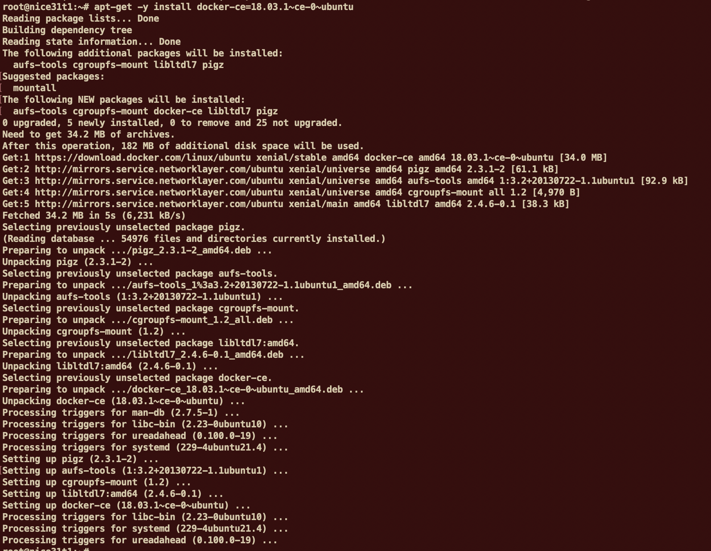
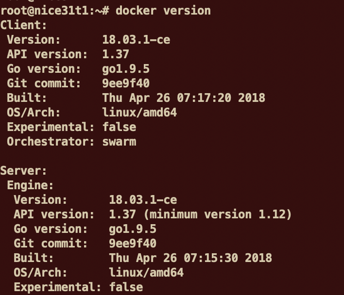
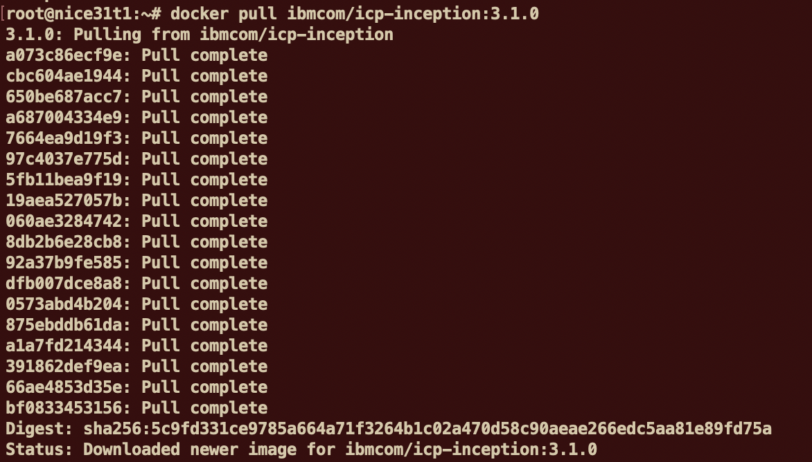
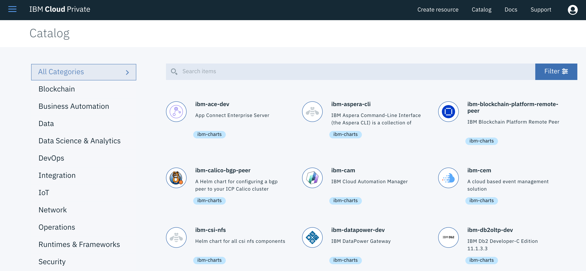
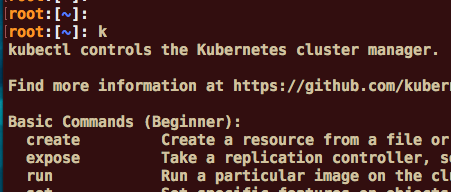
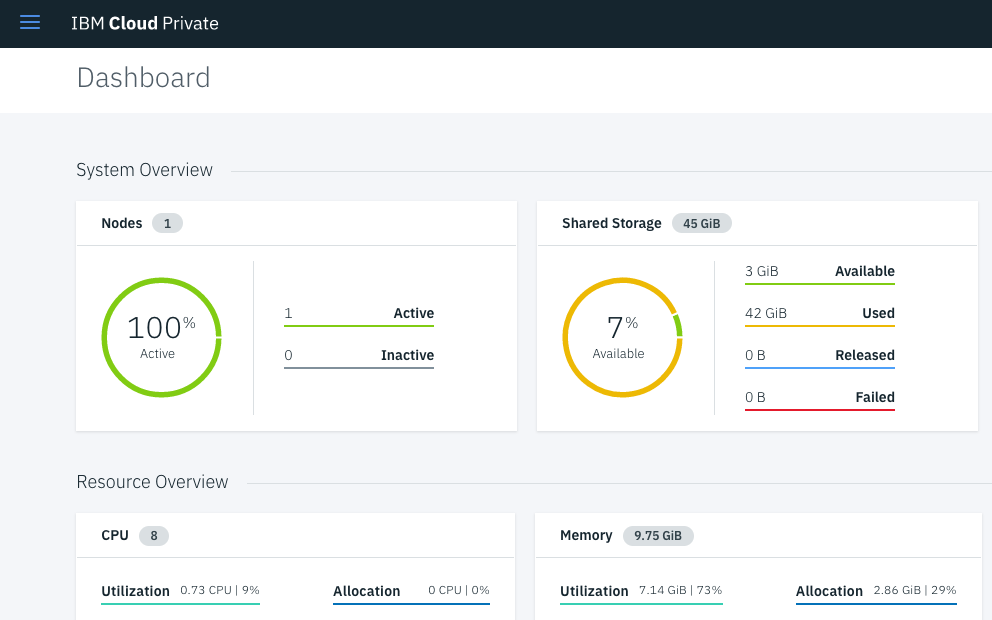
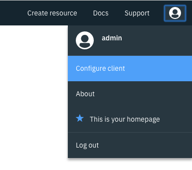

---
# Single Node Installation - IBM Cloud Private
---

This Lab is compatible with ICP version 3.1.0


# Table of Content
---
- [Single Node Installation of IBM Cloud Private](#single-node-installation-of-ibm-cloud-private)
- [Table of Content](#table-of-content)
- [1. IBM Cloud Private Overview](#1-ibm-cloud-private-overview)
    + [What is a private Cloud ?](#what-is-a-private-cloud--)
    + [Terminology](#terminology)
    + [Architecture](#architecture)
- [2. Objectives](#2-objectives)
- [3. Prerequisites](#3-prerequisites)
- [4. First Option: Install ICP on Ubuntu VM](#4-first-option--install-icp-on-ubuntu-vm)
    + [Task 1 : Configuring the system](#task-1---configuring-the-system)
    + [Task 2 : Add Docker’s official GPG key](#task-2---add-docker-s-official-gpg-key)
    + [Task 3: Add a repo to get the Docker](#task-3--add-a-repo-to-get-the-docker)
    + [Task 4: Get Docker](#task-4--get-docker)
    + [Task 5: Download IBM Cloud Private](#task-5--download-ibm-cloud-private)
    + [Task 6: SSH Keys setup](#task-6--ssh-keys-setup)
    + [Task 7: Customize ICP](#task-7--customize-icp)
    + [Task 7: Install ICP](#task-7--install-icp)
    + [Task 8: Install and configure CLIs](#task-8--install-and-configure-clis)
    + [Task 9: Adding persistent storage to Kubernetes](#task-9--adding-persistent-storage-to-kubernetes)
    + [Task 10: End of installation](#task-10--end-of-installation)
- [5. Conclusion](#6-conclusion)
    + [Results](#results)
- [End of Lab](#end-of-lab)
- [Appendix A : How to connect to an ICP cluster](#end-of-lab)
---


# 1. IBM Cloud Private Overview

**IBM Cloud Private** is a private cloud platform for developing and running workloads locally. It is an integrated environment that enables you to design, develop, deploy and manage on-premises, containerized cloud applications behind your firewall. It includes the container orchestrator Kubernetes, a private image repository, a management console and monitoring frameworks.

### What is a private Cloud ?

 Private cloud is a cloud-computing model run solely for one organization. It can be managed internally or by third party, and can be hosted behind the company firewall or externally. Private cloud offers the benefits of a public cloud, including rapid deployment and scalability plus ease of use and elasticity, but also provides greater control, increased performance, predictable costs, tighter security and flexible management options. Customize it to your unique needs and security requirements.

### Terminology

- **master node** :  
    - controls and manages the cluster
    - **Kubectl**:  command line client
    - REST API:  used for communicating with the workers
    - Scheduling and replication logic
    - Generally 3 or more master nodes for resiliency
- **worker node**
    - is a worker machine in Kubernetes, previously known as a minion. A node may be a **VM** or **physical machine**, depending on the cluster. Each node has the services necessary to run pods and is managed by the master components.
    - **Kubelet**  agent that accepts commands from the master
    - **Kubeproxy**: network proxy service on a node level, responsible for routing activities for inbound or ingress traffic
    - Docker host
- **Containers**: Units of packaging
- **Pods**:
    - A collection of containers that run on a worker node
    - A pod can contain more than one service
    - Each pod has it’s own IP
    - A pod shares a PID namespace, network, and hostname
- **Replication Controller**
:
    - Ensures availability and scalability
    - Responsible for maintaining as many pods as requested by the user
    - Uses a template that describes specifically what each pod should contain
- **Labels**:

    - Metadata assigned to K8 resources – such as pods, services
    - Key-Value pairs for identification
    - Critical to K8s as it relies on querying the cluster for resources that have certain labels
- **Services:**
    - Collection of pods exposed as an endpoint
    - Information stored in the K8 cluster state and networking info propagated to all worker nodes
- **Secrets**:
    - Sensitive information that containers need to read or consume
    - Are special volumes mounted automatically so that the containers can read its contents
    - Each entry has it’s own path


### Architecture

See below a global picture showing ICP architecture and most common components.


This lab is going to focus on the couple "Docker & Kubernetes" which is the main foundation of IBM Cloud Private. In this lab, all nodes will be part of a single VM.

# 2. Objectives


In this first lab, you will prepare and install IBM Cloud Private (ICP) on a **single node** (host) running on a VM (thru VMware or it could be a Virtual Server in a Cloud or a VirtualBox).

You will learn how to:

- prepare your platform to support a single node ICP (i.e all nodes - master, worker, proxy, boot nodes will be concentrated in one node)
- configure the installation setup for ICP
- check and validate all the prerequisites
- install Docker and Hyperkube
- check all the components


# 3. Prerequisites

This lab needs some hardware and software prerequisites.

At least (minimal):
- [ ] one host (physical or virtual)
- [ ] CPU = 8 cores (or virtual cores)
- [ ] RAM = 10 GB (10,240 MB)
- [ ] Storage = 40 GB (depending on the other solutions that you install on top of ICP)
- [ ] Linux OS like Ubuntu 16.04 LTS 

If you need some more help, see the official documentation: [here](https://www.ibm.com/support/knowledgecenter/en/SSBS6K_3.1.0/kc_welcome_containers.html)

or

https://www.ibm.com/support/knowledgecenter/en/SSBS6K_3.1.0/kc_welcome_containers.html

# 4. Install ICP on Ubuntu VM

Be sure that you have already prepared a VMware VM or a virtual server containing an **Ubuntu** system up and running. Login to the Ubuntu system as **root** or sudo -i once connected.

> **ipaddress** is the ip address of the VM and subsequently the ip address of the different nodes in this lab.

Here are the steps:

### Task 1 : Configuring the system

Before updating the operating system, check the **/etc/hosts** file in Linux.

Use **putty** or **ssh** to get connected to the ubuntu VM.

`ssh root@ipaddress`


Once connected, check your (public) ip address by typing the command:

`ifconfig`

Results:
```console
# ifconfig
eth0      Link encap:Ethernet  HWaddr 06:41:88:4e:6f:f3  
          inet addr:10.45.154.246  Bcast:10.45.154.255  Mask:255.255.255.192
          inet6 addr: fe80::441:88ff:fe4e:6ff3/64 Scope:Link
          UP BROADCAST RUNNING MULTICAST  MTU:1500  Metric:1
          RX packets:1813 errors:0 dropped:0 overruns:0 frame:0
          TX packets:57 errors:0 dropped:0 overruns:0 carrier:0
          collisions:0 txqueuelen:1000
          RX bytes:144586 (144.5 KB)  TX bytes:4102 (4.1 KB)

eth1      Link encap:Ethernet  HWaddr 06:29:fc:86:31:fa  
          inet addr:158.175.102.12  Bcast:158.175.102.15  Mask:255.255.255.240
          inet6 addr: fe80::429:fcff:fe86:31fa/64 Scope:Link
          UP BROADCAST RUNNING MULTICAST  MTU:1500  Metric:1
          RX packets:125968 errors:0 dropped:0 overruns:0 frame:0
          TX packets:101137 errors:0 dropped:0 overruns:0 carrier:0
          collisions:0 txqueuelen:1000
          RX bytes:13508626 (13.5 MB)  TX bytes:17795310 (17.7 MB)
```

**Better use the following command** :

`curl ifconfig.co`

Results:
```console
# curl ifconfig.co
158.175.102.12
```

> This address should be same as the one used to ssh your VM.
> Take a note of this ip address. This will be referred as **ipaddress** in the labs. 

Then, edit the hosts file with this command:

`nano /etc/hosts`

You should have the following lines already in the file:
```console
127.0.0.1	localhost
127.0.1.1	myhostname.workshop	myhostname
...
```

> Note : you can see some IP v6 definitions - **don't touch them**

> **Don't touch the hostnames**

Change the line containing **127.0.1.1** with your **ipaddress**. So it look like:

**123.456.789.123**   myhostname.workshop	    myhostname     

Your /etc/hosts file should look like that after the change (please don't touch the hostnames):

```console
# more /etc/hosts
127.0.0.1	        localhost
123.456.789.123 	niceicp15.sl.workshop	niceicp15
...
```

Save the file (ctrl O, enter, ctrl X )

Use the following 2 commands to **update** the system with some complementary packages:

```console
apt update
apt-get install apt-transport-https ca-certificates curl software-properties-common python-minimal jq
```

Check carefully the output to see if you have errors and especially if you cannot connect.


Increase your virtual memory maximum by typing the command:

`sysctl -w vm.max_map_count=262144`

K8s won't run with swap enabled. swapoff -a is the Ubuntu command for disabling it.

`swapoff -a`


> IMPORTANT. The 2 previous commands only work when the system is online. If it is rebooted then these settings are lost and have to be re-run before k8s will start. 

These commands can be turned on permanently by typing:

```
sed -i '/ swap / s/^/#/' /etc/fstab
echo "vm.max_map_count=262144" >> /etc/sysctl.conf
```


### Task 2 : Add Docker’s official GPG key

Use the following command:

```console
curl -fsSL https://download.docker.com/linux/ubuntu/gpg | apt-key add -
```

### Task 3: Add a repo to get the Docker

Use the following 2 commands:

```console
add-apt-repository "deb [arch=amd64] https://download.docker.com/linux/ubuntu $(lsb_release -cs) stable"
```

`apt-get update`

### Task 4: Get Docker

You can list all versions available in the added repo:

`apt-cache madison docker-ce`

Use the following command to get Docker installed (Docker version 18.03.1 is the maximum version supported by IBM Cloud Private 3.1.0):

`apt-get -y install docker-ce=18.03.1~ce-0~ubuntu`



Check that Docker is running (client and server):

`docker version`



> Docker client is mainly the CLI. The server is composed of different programs and among then, there is the **containerd**, the engine managing the isolation/running of containers.

You can look around at the docker CLI (and go thru some of  the sub-commands) by just typing:

`docker`

`docker ps`

`docker images`

Another lab will go in detail to explain how Docker is managing the images and running them.

### Task 5: Download IBM Cloud Private

We are going to use Docker to download the ICP-ce (community edition) package from the **dockerHub** web site:

`docker pull ibmcom/icp-inception:3.1.0`

IBM has packaged all the main components necessary for the installation in one package (note that you can change the version to a more recent one if needed). The pull sub-command is going to download the image on the local file system (the image will be run to install ICP).



Create a directory and move to that directory:

`mkdir /opt/icp`

`cd /opt/icp`  

Copy the ICP package into that directory:

```console
docker run -e LICENSE=accept -v "$(pwd)":/data ibmcom/icp-inception:3.1.0 cp -r cluster /data
```

> Note:  this docker command is executing the linux copy (cp) command from the volume (-v parameter). This will create a cluster directory in /opt/icp with all necessary files.


### Task 6: SSH Keys setup

We are going to generate new ssh keys in the /opt/icp/cluster directory:

`ssh-keygen -b 4096 -f ~/.ssh/id_rsa -N "" `

`cat ~/.ssh/id_rsa.pub | sudo tee -a ~/.ssh/authorized_keys `

`systemctl restart sshd `

`cp ~/.ssh/id_rsa ./cluster/ssh_key  `

> Finally a new key should now exist in the /opt/icp/cluster:

`ls /opt/icp/cluster`


### Task 7: Customize ICP

Add the IP address of each node in the cluster to the **/opt/icp/cluster/hosts file** (in our case, we use the same ip address for each component).

> Use the unique **ipaddress** that you have already used.

`nano /opt/icp/cluster/hosts`


Save the file (ctrl O, enter, ctrl X ).

To understand the installation setup, you can look at the /opt/icp/cluster/config.yaml where you will find all the parameters.

`more /opt/icp/cluster/config.yaml`

No need to change for default installation.

> *hosts* and *config.yaml* are the 2 most important files to parameter the ICP installation. In a "standard configuration" with multiple worker nodes, you should specify a list of IP addresses under the worker section. At the time of this version, only ip addresses are supported in the *hosts* file.

**You are now ready to install IBM Cloud Private**.


### Task 7: Install ICP

Finally install ICP by using those commands:

`cd /opt/icp/cluster`

```console
docker run -e LICENSE=accept --net=host -t -v "$(pwd)":/installer/cluster ibmcom/icp-inception:3.1.0 install
```

Installation should last around 20 minutes. Check messages.
In case of error (red messages), make the appropriate change in the configuration files. Sometimes the installation can slowdown a little bit with **Retrying** messages  (during IAM startup for instance).

The end of the installation should look like this :


> Note that during a simple installation, there are **no failures and no errors**. If some errors occur and the install exits then first retry the install command and follow the instructions. If it doesn't work then "uninstall" ICP, correct the issue and restart the install process.

**In case of Uninstall**
```console
docker run -e LICENSE=accept --net=host -t -v "$(pwd)":/installer/cluster ibmcom/icp-inception:3.1.0 uninstall
```


**BEFORE GOING TO THE NEXT STEP, WAIT 2 MINUTES** so that everything can start gracefully.


Use the green link at the end of the installation script to get access to the console (admin/admin) in a browser:

`https://ipaddress:8443`  


You should receive the **Welcome Page**:


Click on the **Catalog** menu (top right) to look at the list of applications already installed:



The **Catalog** shows Charts that you can visit (it could take au few seconds to refresh the first time)

You can look at the (helm) catalog and visit some entries (but don't create any application at the moment).

### Task 8: Install and configure CLIs

At this point, you will need to install the **Kubernetes CLI** (command kubectl).  
For that purpose, open a ssh terminal with the Ubuntu VM in root mode.

Use the following command to download **kubectl**:

```console
docker run -e LICENSE=accept --net=host -v /usr/local/bin:/data ibmcom/icp-inception:3.1.0 cp /usr/local/bin/kubectl /data
```

This docker command will copy the kubectl program to the /usr/local/bin.

We now need to configure kubectl to get access to the cluster. An alternative method can be used (see Appendix A : How to get connected to the cluster) if you are interested.

We are going to create a **script** to help us to connect to our cluster.
Type the following commands :

`cd`

`nano connect2icp.sh`

Copy the following code :

```console
CLUSTERNAME=mycluster
ACCESS_IP=`curl ifconfig.co`
USERNAME=admin
PASSWD=admin

token=$(curl -s -k -H "Content-Type: application/x-www-form-urlencoded;charset=UTF-8" -d "grant_type=password&username=$USERNAME&password=$PASSWD&scope=openid" https://$ACCESS_IP:8443/idprovider/v1/auth/identitytoken --insecure | jq .id_token | awk  -F '"' '{print $2}')

kubectl config set-cluster $CLUSTERNAME.icp --server=https://$ACCESS_IP:8001 --insecure-skip-tls-verify=true
kubectl config set-context $CLUSTERNAME.icp-context --cluster=$CLUSTERNAME.icp
kubectl config set-credentials admin --token=$token
kubectl config set-context $CLUSTERNAME.icp-context --user=admin --namespace=default
kubectl config use-context $CLUSTERNAME.icp-context
```

Save the file (ctrl O, enter, ctrl X ) and make this file executable :

`chmod +x connect2icp.sh`

> These lines in that script are getting a token automatically for you. But every 12 hours, the token expires and you will need to type that script (connect2icp.sh) again. 

Then execute that shell program :

`~/connect2icp.sh`

Results :

```console
# ~/connect2icp.sh
Cluster "cluster.local" set.
Context "cluster.local-context" modified.
User "admin" set.
Context "cluster.local-context" modified.
Switched to context "cluster.local-context".
```


As a result, you will see that you are now **connected** for **12 hours** to the cluster (with only one node):

`kubectl version --short`

Results :

```console
# kubectl version --short
Client Version: v1.11.1
Server Version: v1.11.1+icp
```

Try this command to show all the worker nodes :

`kubectl get nodes`

Results :

```console
# kubectl get nodes
NAME            STATUS    ROLES     AGE       VERSION
169.50.200.70   Ready     etcd,management,master,proxy,worker   35m       v1.11.1+icp
```

> After a long period of inactivity, if you see some connection error when typing a kubectl command then re-execute the `~/connect2icp.sh` command.

To get help from the kubectl, just type this command:

`kubectl`

> **Optional** : it could be interesting to define an alias name for docker and kubectl commands.

To do so, from the ssh terminal, type the following commands:

`cd`

`nano .bashrc`

At the end of the file, add the 3 lines:

```console
alias k='kubectl'
alias d='docker'
alias h='helm'
```

Save the file (ctrl O, enter, ctrl X ). Source your script with the following command:

`source .bashrc`

Now test your new commands:



Finally, you can also install the **cloudctl** command. This command can be used to configure and manage IBM Cloud Private. 

Type the following curl command to download cloudctl (don't forget to change the ipaddress):

`curl -kLo cloudctl-linux-amd64-3.1.0-715 https://ipaddress:8443/api/cli/cloudctl-linux-amd64`

Results:

```console 
curl -kLo cloudctl-linux-amd64-3.1.0-715 https://169.50.200.70:8443/api/cli/cloudctl-linux-amd64
  % Total    % Received % Xferd  Average Speed   Time    Time     Time  Current
                                 Dload  Upload   Total   Spent    Left  Speed
100 13.9M  100 13.9M    0     0  38.4M      0 --:--:-- --:--:-- --:--:-- 38.4M

```

Now execute the following commands to change cloudctl to executable and to move that CLI to the right directory :

```
chmod 755 /root/cloudctl-linux-amd64-3.1.0-715
mv /root/cloudctl-linux-amd64-3.1.0-715 /usr/local/bin/cloudctl
```

Execute the **cloudctl** command for the first time 

`cloudctl`

Results:
```console 
# cloudctl
NAME:
   cloudctl - A command line tool to interact with IBM Cloud Private

USAGE:
[environment variables] cloudctl [global options] command [arguments...] [command options]

VERSION:
   3.1.0-715+e4d4ee1d28cc2a588dabc0f54067841ad6c36ec9

COMMANDS:
   api       View the API endpoint and API version for the service.
   catalog   Manage catalog
   cm        Manage cluster
   config    Write default values to the config
   iam       Manage identities and access to resources
   login     Log user in.
   logout    Log user out.
   plugin    Manage plugins
   pm        Manage passwords
   target    Set or view the targeted namespace
   tokens    Display the oauth tokens for the current session. Run cloudctl login to retrieve the tokens.
   version   Check cli and api version compatibility
   help      
   
Enter 'cloudctl help [command]' for more information about a command.

ENVIRONMENT VARIABLES:
   CLOUDCTL_COLOR=false                     Do not colorize output
   CLOUDCTL_HOME=path/to/dir                Path to config directory
   CLOUDCTL_TRACE=true                      Print API request diagnostics to stdout
   CLOUDCTL_TRACE=path/to/trace.log         Append API request diagnostics to a log file

GLOBAL OPTIONS:
   --help, -h                         Show help

```


Before using the **cloudctl** with the master, you must login to the master:

`cloudctl login -a https://mycluster.icp:8443 --skip-ssl-validation`

> For the login : admin/admin

```console
# cloudctl login -a https://mycluster.icp:8443 --skip-ssl-validation

Username> admin

Password> 
Authenticating...
OK

Select an account:
1. mycluster Account (id-mycluster-account)
Enter a number> 1
Targeted account mycluster Account (id-mycluster-account)

Select a namespace:
1. cert-manager
2. default
3. istio-system
4. kube-public
5. kube-system
6. platform
7. services
Enter a number> 2
Targeted namespace default

Configuring kubectl ...
Property "clusters.mycluster" unset.
Property "users.mycluster-user" unset.
Property "contexts.mycluster-context" unset.
Cluster "mycluster" set.
User "mycluster-user" set.
Context "mycluster-context" created.
Switched to context "mycluster-context".
OK

Configuring helm: /root/.helm
OK

```

With that **cloudctl cm** CLI, you can manage the infrastructure part of the cluster like adding new worker nodes (machine-type-add, worker-add) and so on.

Then you can type some commands concerning your cluster:

`cloudctl cm masters mycluster`

Results
```console
# cloudctl cm masters mycluster
ID             Private IP      Machine Type   State   
mycluster-m1   169.50.200.70   -              deployed 
```

Among all sub-commands in 'ibmcloud pr', there are some commands to manage the infrastructure components like :
- cluster
- workers (adding, removing ...)
- register (docker image management )
- helm repositories


### Task 9: Adding persistent storage to Kubernetes

Go to the ICP management console and click on the menu (top left hand side).
Select **Dashboard** in the menu.


Normally after the installation, all internal storage is used by ICP (so that's why we see 0 % available in the storage metric).
We are now going to add some persistent storage.
In the terminal, use the following commands:

`cd /tmp`

`mkdir data01`

Open a file with that command:

`nano pv-rwo.yaml`

Copy and paste the following text in the file (this is a kubernetes document):

```console
apiVersion: v1
kind: PersistentVolume
metadata:
  name: hostpath-pv-once-test1
spec:
  accessModes:
  - ReadWriteOnce
  capacity:
    storage: 1Gi
  hostPath:
    path: /tmp/data01
  persistentVolumeReclaimPolicy: Recycle
```
Save the file (ctrl O, enter, ctrl X ).

With that document, we are telling Kubernetes to create a persistent storage of 1GB with **read/write once** mode in the host path /tmp/data01.

To create this persistent volume, just type the following command:

`kubectl create  -f ./pv-rwo.yaml`


Now create a 2GB persistent storage volume with read/write/many mode:

`nano pv-rwm.yaml`

Copy and paste the following text in the file (this is a kubernetes document):

```console
apiVersion: v1
kind: PersistentVolume
metadata:
  name: hostpath-pv-many-test1
spec:
  accessModes:
  - ReadWriteMany
  capacity:
    storage: 2Gi
  hostPath:
    path: /tmp/data01
  persistentVolumeReclaimPolicy: Recycle
```
Save the file (ctrl O, enter, ctrl X ).
And then use the following command:

`kubectl create  -f ./pv-rwm.yaml`

Once created these 2 volumes (hostpath) should be listed with the following command:

`kubectl get pv`


> Note: the 2 volumes are shown as available storage.

Now go back to the Dashboard to see the change:




### Task 10: End of installation

At this point, you can now go thru some other labs to implement applications using containers and Kubernetes solutions.


# 5. Conclusion

###  Results
<span style="background-color:yellow;">Successful exercise ! </span>
You finally went thru the following features :
- [x] You setup a VM using Ubuntu version 16.04
- [x] You checked all the prerequisites before the ICP installation
- [x] You installed Docker
- [x] You installed ICP community edition (version 3.1.0) on one host
- [x] You connected to the ICP console
- [x] You setup the kubectl command line
- [x] You setup some persistent storage
- [x] You installed a functional Kubernetes Cluster on a single Node for testing and learning

---
# End of Lab
---

#  appendix A : How to connect to a cluster

You need to setup the endpoint to tell the kubectl command where is the ICP Cluster and what are the correct certificates.
To do so, go to the ICP console and select your profile on the right hand:



Click on Configure client:


These 5 lines contain a token that change every 12 hours. So then, you generally have to use these 5 commands to get connected.

A connect2icp.sh script is provided to avoid this problem. 

---
# End of Appendix
---


